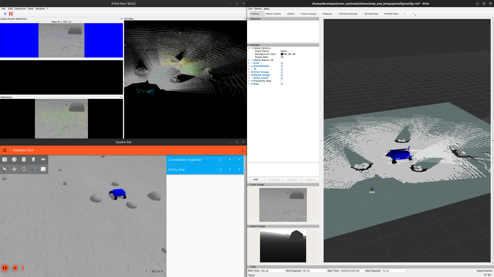

# Mały Wóz
Projekt łazika marsjańskiego.

# Uruchomienie dema

## Wymagania

Kod używa ROS 2 Humble i jest rozwijany głównie dla Linux Ubuntu 22.04.
Może być możliwe uruchomienie go na innych platformach, ale obecnie nie są one explicite wspierane.

### Docker

Zaleca się używanie Dockera, aby zapewnić jednolite środowisko dla wszystkich programistów.
Najpierw musisz go zainstalować, korzystając z [oficjalnych instrukcji](https://docs.docker.com/engine/install/ubuntu/#install-using-the-repository).
Pamiętaj również o wykonaniu [post-installation steps](https://docs.docker.com/engine/install/linux-postinstall/), zwłaszcza „Manage Docker as a non-root user”.
Możesz się upewnić, że instalacja Dockera działa, uruchamiając polecenie `docker run hello-world`, które powinno wyświetlić komunikat powitalny.

### NVIDIA z Dockerem

Jesteśmy zależni od GPU NVIDII, więc musimy upewnić się, że Docker może go używać.
Najpierw upewnij się, że masz zainstalowane sterowniki GPU na komputerze hosta, możesz skorzystać z [instrukcji z Ubuntu help](https://help.ubuntu.com/community/NvidiaDriversInstallation).
Następnie musisz zainstalować NVIDIA Container Toolkit na swoim komputerze, aby Docker mógł korzystać z GPU.
Skorzystaj z [oficjalnej instrukcji](https://docs.nvidia.com/datacenter/cloud-native/container-toolkit/install-guide.html), aby zainstalować.
Możesz sprawdzić, czy wszystko skonfigurowałeś poprawnie, uruchamiając polecenie `docker run --rm --runtime=nvidia --gpus all nvidia/cuda:11.6.2-base-ubuntu20.04 nvidia-smi`, które powinno wyświetlić informacje o GPU (nazwa, wersja sterownika, temperatura itp.).

TODO: może nie potrzebujemy Nvidii?

### Uruchamianie dema pod Windowsem w WSL2

Aby wykorzystać WSL zapoznaj się z tym [plikiem](docs/WSL.md).

## Budowanie i uruchomienie kontenera Dockera

Aby zbudować obraz Dockera, uruchom `./build_image.sh`.
Aby uruchomić kontener, uruchom `./run_image.sh`.
Pamiętaj, aby nie zamykać tego terminala, ponieważ spowoduje to również zabicie działającego kontenera.
Możesz dołączyć do działającego kontenera z innych terminali za pomocą `./attach.sh` (te można normalnie zamknąć).

## Budowanie kodu

Repozytorium jest workspacem ROSa.
Aby go zbudować, uruchom `./bild` (jest to skrót dla `colcon build ...`).
Po zbudowaniu musimy source'ować obszar roboczy, aby terminal wiedział, gdzie znajdują się zbudowane obiekty.
Możesz to zrobić za pomocą `. sor`.
Musisz uruchamiać to za każdym razem, gdy dodajesz nową paczkę lub nowe foldery, ale jest to szybkie do uruchomienia, więc najlepiej jest uruchamiać to często (po budowaniu) i wyeliminować potencjalne problemy.
Budowanie tworzy linki symboliczne, co oznacza, że można zmieniać pliki niekompilowalne (konfiguracyjne, Pythona, xmle, itd.) bezpośrednio w folderze `src` i będzie to działać (zmiany w C++ wymagają oczywiście ponownej kompilacji).

## Uruchamianie dema

Po zbudowaniu i source'owaniu możesz uruchomić demo za pomocą `./start_sim` (skrót dla `ros2 launch ...`).
Powinna wystartować symulacja (Gazebo/Ignition) i wizualizacja (RViz)  z prostym łazikiem na "Księżycu", a także RTAB-Map umożliwiający odometrię i mapowanie otoczenia.
Uruchamiane są również node'y obsługujące sterowanie joystickiem, więc jeśli taki podłączysz, powinieneś być w stanie kontrolować łazik.
Można również (w osobnym terminalu) uruchomić `./teleop`, który uruchomi node umożliwiający sterowanie za pomocą klawiatury.

# Development

Do pisania kodu polecany jest VS Code, ponieważ łatwo łączy się z Dockerem, wspiera jednocześnie C++ i Pythona (i inne), ma pluginy do ROSa.

Aby połączyć się z kontenerem, zainstaluj dodatek "Dev Containers".
Upewnij się, że kontener Dockera jest uruchomiony, a następnie uruchom "linię komand" VS Code za pomocą `Ctrl + Shft + P` i uruchom `Dev Containers: Attach to Running Container`, a potem wybierz nasz kontener `/rover almu_rover` z listy.
VS Code otworzy nowe okno, które będzie miało kod w środku kontenera.
Dzięki temu VS Code będzie widział symbole które są zainstalowane i zbudowane w kontenerze i będzie mógł lepiej podpowiadać składnię.

W kontenerze zainstaluj dodatki jakie poleca VS Code (ROS, ROS2, Python, C/C++ Extension Pack).

TODO: prawdopodobnie VS Code nie będzie widział jeszcze wszystkich zainstalowanych symboli, trzeba dodać odpowiednie ścieżki do jego ustawień.

# Znane problemy

Symulacja zabiera zaskakująco dużo CPU jak na to, że nic się nie dzieje.
Trzeba popatrzyć czy nie jest coś źle z konfiguracją.
